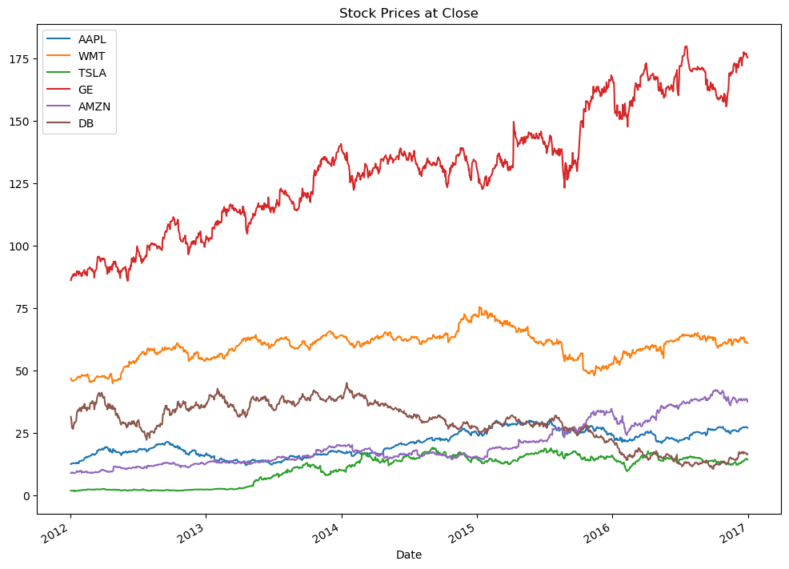
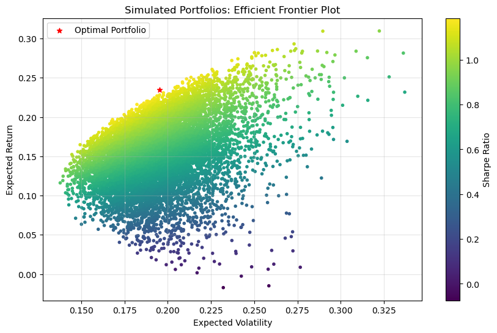
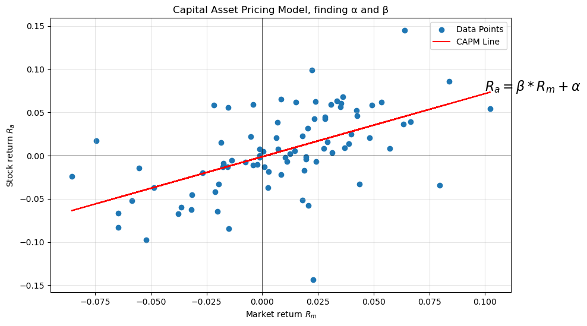
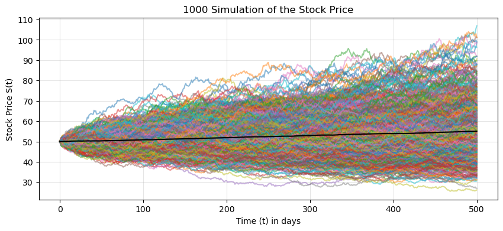
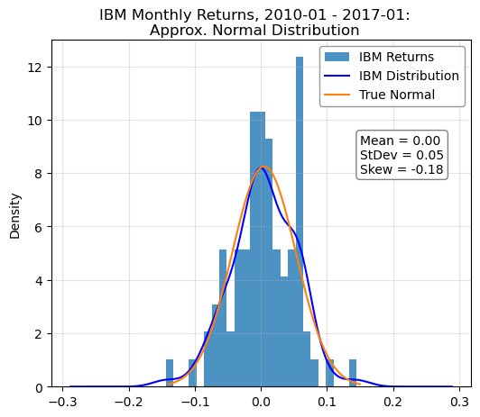
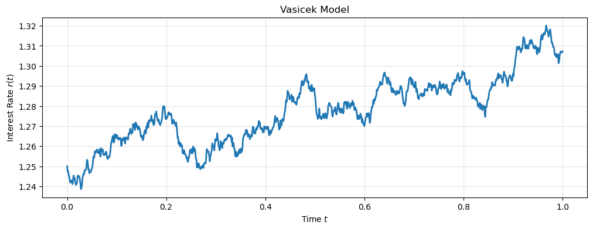

# Quantitative Finance with Python

This repo documents my progress, exercises done and knowledge acquired during this [Udemy course](https://www.udemy.com/course/quantitative-finance-algorithmic-trading-in-python/).

The course has the following sections:
1. Introduction
2. Environment Setup
3. Stock Market Basics

4. Bond Theory
5. Bond Implementation
6. Modern Portfolio Theory
7. Markowitz Model Implementation

8. Capital Asset Pricing Model (CAPM)
9. CAPM Implementation

10. Derivatives Basics
11. Random Behavior in Finance

12. Black-Scholes Model
13. Black-Scholes Implementation
14. Value at Risk (VaR)

15. Colleteralized Debt Obligations (CDOs)
16. Interest Rate Modeling (Vasicek Model)

17. Bond Pricing with Vasicek Model
18. Long-Term Investing